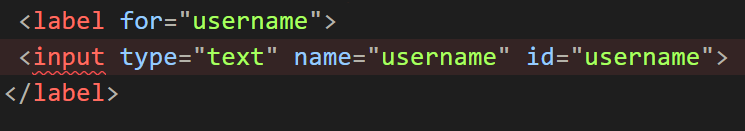
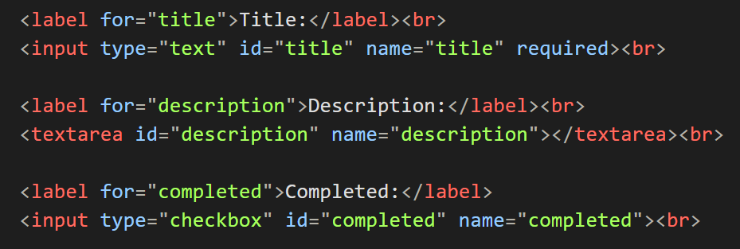
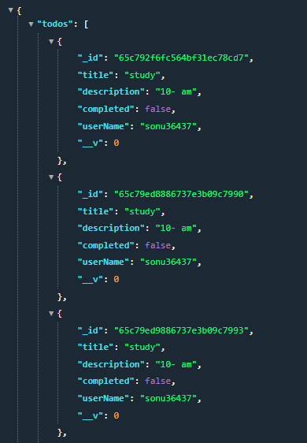

# ToDoApi

This is api for to-do list app this api support all the essential crud operations such as (read,write, delete, update);

# Routes

# user Route

This route is basically need for creating user and every individual users must have unique name

POST :  `api/createUser`

For Frontend inputBox should be named like this:

# create To-do route

This route basically post to-do from client to Database server

POST : `api/createToDo/username`

input boxes should be named like this 

For front-end it must contains all the three inputBoxes

1. For title
2. For Description
3. completed or not (you can use option here)

 Note: username must be provided in params  like this `api/createToDo/sonu36437`

# Get all to-do of user 

This will give you all the to-do's of a particular user 

GET : `api/allToDos/username`

Example : `http://localhost:5000/api/allToDos/sonu36437`

# Delete a particular to-do

This is a Delete route it will delete a particular  to-do having particular id each to-do have unique id you can look at the image in `GET all to-do route` each task have a unique id 

DELETE : `api/deletetodo/id`

Example : `http://localhost:5000/api/deletetodo/65c76ee4b85d66f4f210258b`

# update To-do route

Either task is completed or user want to edit someData.

As mentioned above each task have their unique id can be use for editing document as well

PUT : `api/updateTodo/id`

Example : `http://localhost:5000/api//updateTodo/65c79edc886737e3b09c799c`
